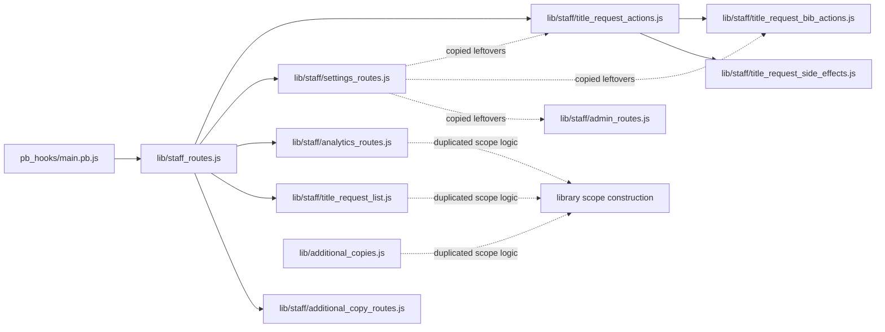
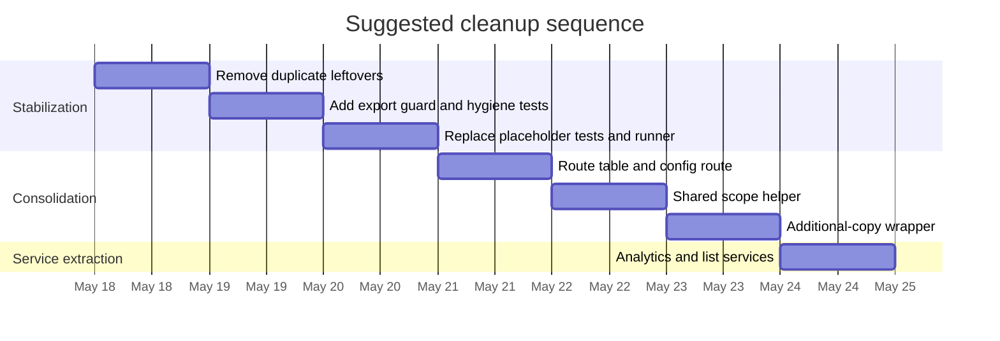

# Detailed implementation guide for stabilizing and completing the ASAP PocketBase staff-route refactor

## Executive summary

PR #168, merged on May 16, 2026, completed the first major split of the old monolithic `staff_routes.js` into many `lib/staff/*` modules, but the merged tree still has follow-up cleanup debt that is worth addressing immediately in a tightly scoped stabilization pass. The current repository still contains copied action/admin code inside `lib/staff/settings_routes.js`, duplicated helper blocks and duplicate export entries in `lib/staff/title_request_bib_actions.js`, the same duplicate-block pattern in `lib/staff/title_request_side_effects.js`, and a stale `lib/staff_routes.js.orig` file. The facade in `lib/staff_routes.js` is also currently assembled with object spreads; in JavaScript, later properties silently override earlier ones, which means duplicate exports can be masked instead of failing loudly. fileciteturn35file0 fileciteturn18file0 fileciteturn17file0 fileciteturn51file0 fileciteturn33file0 fileciteturn9file0 fileciteturn44file0 citeturn6view1turn3view0

The test story is also incomplete. The current `package.json` runs only five explicit test files with direct `node` invocations, while multiple newly added staff tests are placeholders that exist only “to satisfy the PR requirement” and do not assert behavior. At least `tests/staff_auth_users.test.js`, `tests/staff_lookup.test.js`, `tests/staff_title_request_action.test.js`, `tests/staff_title_request_list.test.js`, and `tests/staff_additional_copies_list.test.js` fall into that category, while real focused tests such as `tests/staff_analytics.test.js` and `tests/staff_phase_entry_sort.test.js` already demonstrate the lightweight Node + `assert` style the repo is using. fileciteturn8file0 fileciteturn38file0 fileciteturn45file0 fileciteturn37file0 fileciteturn47file0 fileciteturn46file0 fileciteturn30file0 fileciteturn52file0 citeturn4view2turn4view0turn4view1

The most effective plan is to split the work into three reviewable PRs. First, a stabilization PR for items 1–5. Second, a consolidation PR for items 6–8. Third, a service-extraction PR for item 9. That sequencing keeps the highest-value correctness fixes first, adds guardrails before deeper restructuring, and reduces rollback risk if any one architectural step turns out to be noisier than expected. This is especially important because the production runtime is PocketBase’s JavaScript hook VM with CommonJS-style modules, while tests run in Node via `package.json`; that means production code should stay dependency-light and CommonJS-compatible, and Node-only helpers should live in tests and CI only. fileciteturn31file0 fileciteturn32file0 fileciteturn8file0 citeturn3view0turn4view2

| Priority | Scope | Items | Primary files | Estimated effort |
|---|---|---:|---|---:|
| Highest | Stabilize merged refactor | 1–5 | `lib/staff/settings_routes.js`, `lib/staff/title_request_bib_actions.js`, `lib/staff/title_request_side_effects.js`, `lib/staff_routes.js`, `package.json`, `tests/*` | 8–12 hours |
| High | Consolidate route wiring and scope logic | 6–8 | `pb_hooks/main.pb.js`, new `lib/config_routes.js`, new `lib/staff/scope.js`, `lib/additional_copies.js`, `lib/staff/additional_copy_routes.js` | 6–8 hours |
| Medium | Extract services without breaking public API | 9 | new `lib/staff/*_service.js`, `lib/staff/title_request_list.js`, `lib/staff/analytics_routes.js` | 4–6 hours |

## Repository state and implementation constraints

The current route shape is a classic facade pattern: `pb_hooks/main.pb.js` registers many `/api/asap/staff/*` routes and lazily `require()`s `../lib/staff_routes.js` inside each handler; `lib/staff_routes.js` then spreads together the exports from many `lib/staff/*` modules. That lazy-load pattern is intentional: `main.pb.js` explicitly says library files are located in `../lib/` to avoid a macOS file-watcher restart loop, so any cleanup to route registration should preserve lazy `require()` resolution rather than switching to eager top-level imports. fileciteturn22file0 fileciteturn9file0

The split is already far enough along that the cleanup should be evolutionary rather than a second rewrite. The dedicated modules that should own the behavior already exist: `title_request_actions.js` contains `staffTitleRequestAction()` and `applyCatalogFoundWorkflow()`, `admin_routes.js` contains `staffDeleteClosedRequest()`, `staffDeleteClosedRequestsBulk()`, `staffTestPolaris()`, `staffTestSmtp()`, and `staffSyncOrganizations()`, and `settings_email.js` already exports the rejection-template constants that `staff_routes.js` redundantly re-adds. That means most of the work below is deleting leftovers, not inventing new behavior. fileciteturn49file0 fileciteturn60file0 fileciteturn44file0 fileciteturn9file0

The remaining architectural duplication is concentrated in three places. `title_request_list.js`, `analytics_routes.js`, and `additional_copies.js` each implement their own “what library scope can this staff user see?” logic with nearly identical mode/filter/params payloads, but with slightly different super-admin default behavior. In parallel, `additional_copy_routes.js` repeats the same load-check-authorize-transform pattern for close, reopen, claim, and unclaim actions, and `main.pb.js` repeats the same `routerAdd(... require(...)[method])` pattern for route after route. Those are strong candidates for centralization once the correctness cleanups land. fileciteturn24file0 fileciteturn25file0 fileciteturn26file0 fileciteturn23file0 fileciteturn22file0

The current test framework is also clear enough to standardize around. The repo does not currently use Mocha or Jest; instead, it uses plain Node-executed scripts with `assert`, and some of the better tests already use source extraction when direct module loading would be awkward. That means the right move for this follow-up is not to introduce a new runner, but to keep the existing style, replace placeholders with real assertions, and make discovery automatic so that every `tests/*.test.js` file actually runs. fileciteturn8file0 fileciteturn28file0 fileciteturn30file0 fileciteturn52file0 citeturn4view2turn4view0turn4view1



## Stabilization tasks for duplicate code and test debt

**Item 1 — remove copied action/admin leftovers from `lib/staff/settings_routes.js`.**  
**Goal:** make `settings_routes.js` contain only settings-related handlers and helpers.  
**Rationale:** the file currently exports only settings APIs, but it still contains copied request-action, Polaris-hold, email side-effect, delete, and sync/test handlers that belong to `title_request_actions.js`, `title_request_bib_actions.js`, and `admin_routes.js`. Those copied functions are dead code today, but they reference undeclared dependencies in this file and materially increase the risk of accidental re-export or edit drift later. fileciteturn18file0 fileciteturn19file0 fileciteturn20file0 fileciteturn49file0 fileciteturn60file0

**Precise edits:** in `lib/staff/settings_routes.js`, delete everything between `staffEmailStatus()` and `getLibraryOverridesSummary()` except the actual settings helpers. In practice, remove the copied blocks for `staffTitleRequestAction`, `applyCatalogFoundWorkflow`, `titleRequestActionContext`, the entire BIB-action helper cluster, `maybeRunImmediatePromoter`, the already-own/reject side-effect stack, purchase-reminder sender, `staffDeleteClosedRequest`, `staffDeleteClosedRequestsBulk`, `staffTestPolaris`, `staffTestSmtp`, and `staffSyncOrganizations`. The exports at the bottom should stay exactly as they are now. fileciteturn18file0 fileciteturn20file0

```diff
diff --git a/lib/staff/settings_routes.js b/lib/staff/settings_routes.js
@@
 function staffEmailStatus(e) {
   ...
 }
-
-function staffTitleRequestAction(e) { ... }
-function applyCatalogFoundWorkflow(app, record, data, staff) { ... }
-function titleRequestActionContext(e) { ... }
-function prepareTitleRequestBibAction(e, context) { ... }
-function staffActionPolarisAuth(app) { ... }
-function handleDuplicateBibRequest(e, context, bibid) { ... }
-function markDuplicateClose(context) { ... }
-function wouldCreateActiveDuplicate(context, bibid) { ... }
-function reconcileBibAction(app, context, staffAuth, bibid) { ... }
-function handleHoldTransitionForBibAction(app, context, staffAuth, bibid, barcode) { ... }
-function closeAutoholdOptOutBibAction(context) { ... }
-function maybePromoteExistingPolarisHold(app, context, staffAuth, bibid, barcode) { ... }
-function finalizeTitleRequestCloseReason(app, context) { ... }
-function maybeRunImmediatePromoter(app, context) { ... }
-function handleAlreadyOwnOrRejectSideEffects(app, context) { ... }
-function refreshedActionPatron(app, record) { ... }
-function handleAlreadyOwnSideEffects(app, context, patron) { ... }
-function placeAlreadyOwnedHold(app, record, bibid, patron) { ... }
-function sendAlreadyOwnedActionEmail(app, record, patron) { ... }
-function sendRejectedActionEmail(app, context, patron) { ... }
-function sendPurchaseReminderIfRequested(app, context) { ... }
-function staffDeleteClosedRequest(e) { ... }
-function staffDeleteClosedRequestsBulk(e) { ... }
-function staffTestPolaris(e) { ... }
-function staffTestSmtp(e) { ... }
-function staffSyncOrganizations(e) { ... }

 function getLibraryOverridesSummary(e) {
   ...
 }
```

**Automated tests to add:** replace the placeholder pattern with a real export-surface test. Edit or add `tests/staff_settings_routes_exports.test.js` so it asserts that `settings_routes.js` exports only the ten intended settings functions, and that `staffTitleRequestAction`, `staffTestPolaris`, and `staffSyncOrganizations` are *not* exported from that module. Because the repo already uses plain `assert`, keep the same style. fileciteturn28file0 citeturn4view2turn4view0

```js
const assert = require("assert");
global.__hooks = __dirname + "/../pb_hooks";

const settingsRoutes = require("../lib/staff/settings_routes.js");
const staffRoutes = require("../lib/staff_routes.js");

assert.deepStrictEqual(Object.keys(settingsRoutes).sort(), [
  "formatClaimRulesForLibrary",
  "formatClaimStaffOptions",
  "getLibraryOverridesSummary",
  "getLibrarySettings",
  "hasLibraryOverride",
  "normalizeRelationId",
  "organizationSyncStatus",
  "staffEmailStatus",
  "updateLibrarySettings",
  "workflowWithEnabled",
].sort());

assert.strictEqual(typeof staffRoutes.staffTitleRequestAction, "function");
assert.strictEqual("staffTitleRequestAction" in settingsRoutes, false);
assert.strictEqual("staffTestPolaris" in settingsRoutes, false);
assert.strictEqual("staffSyncOrganizations" in settingsRoutes, false);

console.log("staff_settings_routes_exports.test.js passed.");
```

**Estimated effort:** 1–2 hours.  
**Risk and rollback:** very low risk, because this is dead-code deletion. If anything surprising appears, revert only this commit and keep the later guard/test items.

**Item 2 — deduplicate `title_request_bib_actions.js`, and fix the same pattern in `title_request_side_effects.js` in the same pass.**  
**Goal:** ensure each helper exists exactly once in the source and each export appears exactly once in `module.exports`.  
**Rationale:** `lib/staff/title_request_bib_actions.js` currently contains a full duplicated copy of its helper set and duplicates the export keys at the bottom; `lib/staff/title_request_side_effects.js` has the same defect. These are correctness hazards because the file looks larger than the real runtime export surface, increases merge-conflict risk, and makes reviewers believe they are editing one function when they may be editing the wrong copy. fileciteturn17file0 fileciteturn51file0

**Precise edits:** in both files, keep one canonical copy of each helper and one unique export entry per symbol. In `title_request_bib_actions.js`, also remove unused imports such as `routeUtils`, `config`, `mail`, and `jobs`, because the retained code path uses `records` and `polaris` but not those imports. In `title_request_side_effects.js`, keep the top copy of each function and delete the repeated lower block. fileciteturn17file0 fileciteturn51file0

```diff
diff --git a/lib/staff/title_request_bib_actions.js b/lib/staff/title_request_bib_actions.js
@@
-const routeUtils = require(`${__hooks}/../lib/route_utils.js`);
 const records = require(`${__hooks}/../lib/records.js`);
-const config = require(`${__hooks}/../lib/config.js`);
-
 const polaris = require(`${__hooks}/../lib/polaris.js`);
-const mail = require(`${__hooks}/../lib/mail.js`);
-const jobs = require(`${__hooks}/../lib/jobs.js`);
@@
-function prepareTitleRequestBibAction(e, context) { ... duplicated block ... }
-...
-function finalizeTitleRequestCloseReason(app, context) { ... duplicated block ... }
-
 module.exports = {
   prepareTitleRequestBibAction,
   staffActionPolarisAuth,
   handleDuplicateBibRequest,
   markDuplicateClose,
   wouldCreateActiveDuplicate,
   reconcileBibAction,
   handleHoldTransitionForBibAction,
   closeAutoholdOptOutBibAction,
   maybePromoteExistingPolarisHold,
-  finalizeTitleRequestCloseReason,
-  prepareTitleRequestBibAction,
-  staffActionPolarisAuth,
-  handleDuplicateBibRequest,
-  markDuplicateClose,
-  wouldCreateActiveDuplicate,
-  reconcileBibAction,
-  handleHoldTransitionForBibAction,
-  closeAutoholdOptOutBibAction,
-  maybePromoteExistingPolarisHold,
   finalizeTitleRequestCloseReason
 };
```

```diff
diff --git a/lib/staff/title_request_side_effects.js b/lib/staff/title_request_side_effects.js
@@
 function sendPurchaseReminderIfRequested(app, context) {
   ...
 }
-
-function maybeRunImmediatePromoter(app, context) { ... duplicated block ... }
-function handleAlreadyOwnOrRejectSideEffects(app, context) { ... duplicated block ... }
-function refreshedActionPatron(app, record) { ... duplicated block ... }
-function handleAlreadyOwnSideEffects(app, context, patron) { ... duplicated block ... }
-function placeAlreadyOwnedHold(app, record, bibid, patron) { ... duplicated block ... }
-function sendAlreadyOwnedActionEmail(app, record, patron) { ... duplicated block ... }
-function sendRejectedActionEmail(app, context, patron) { ... duplicated block ... }
-function sendPurchaseReminderIfRequested(app, context) { ... duplicated block ... }
@@
 module.exports = {
   maybeRunImmediatePromoter,
   handleAlreadyOwnOrRejectSideEffects,
   refreshedActionPatron,
   handleAlreadyOwnSideEffects,
   placeAlreadyOwnedHold,
   sendAlreadyOwnedActionEmail,
   sendRejectedActionEmail,
-  sendPurchaseReminderIfRequested,
-  maybeRunImmediatePromoter,
-  handleAlreadyOwnOrRejectSideEffects,
-  refreshedActionPatron,
-  handleAlreadyOwnSideEffects,
-  placeAlreadyOwnedHold,
-  sendAlreadyOwnedActionEmail,
-  sendRejectedActionEmail,
   sendPurchaseReminderIfRequested
 };
```

**Automated tests to add:** add one source-hygiene test that counts function definitions in the source. This is one of the places where the repo’s existing source-extraction pattern from `tests/staff_phase_entry_sort.test.js` is useful: reading source text and asserting a function marker appears only once is appropriate here. fileciteturn52file0

```js
const assert = require("assert");
const fs = require("fs");
const path = require("path");

function count(source, marker) {
  return (source.match(new RegExp(
    marker.replace(/[.*+?^${}()|[\]\\]/g, "\\$&"),
    "g"
  )) || []).length;
}

const bib = fs.readFileSync(
  path.resolve(__dirname, "../lib/staff/title_request_bib_actions.js"),
  "utf8"
);
assert.strictEqual(count(bib, "function prepareTitleRequestBibAction("), 1);
assert.strictEqual(count(bib, "function finalizeTitleRequestCloseReason("), 1);

const sidefx = fs.readFileSync(
  path.resolve(__dirname, "../lib/staff/title_request_side_effects.js"),
  "utf8"
);
assert.strictEqual(count(sidefx, "function maybeRunImmediatePromoter("), 1);
assert.strictEqual(count(sidefx, "function sendPurchaseReminderIfRequested("), 1);

console.log("staff_duplicate_source_blocks.test.js passed.");
```

**Estimated effort:** 1.5–2.5 hours.  
**Risk and rollback:** low risk if done with tests first. If a regression appears, revert only the side-effects cleanup or only the BIB-actions cleanup, not the entire stabilization PR.

**Item 3 — remove `lib/staff_routes.js.orig` and add a hygiene check so it does not return.**  
**Goal:** eliminate stale files that can confuse grep results, reviewers, and future auto-generated refactors.  
**Rationale:** `lib/staff_routes.js.orig` is still in the tree after PR #168, and it contains the old monolith. That file is not part of the runtime path, but it increases the chance of future copy/paste mistakes and makes repository search noisier. fileciteturn33file0 fileciteturn35file0

**Precise edits:** `git rm lib/staff_routes.js.orig`, and add a small test that recursively fails if any `*.orig` file exists under `lib/`. That test is cheap and catches a surprisingly common artifact in AI-assisted or interrupted refactors. fileciteturn33file0

```bash
git rm lib/staff_routes.js.orig
```

```js
const assert = require("assert");
const fs = require("fs");
const path = require("path");

function walk(dir, results) {
  for (const entry of fs.readdirSync(dir, { withFileTypes: true })) {
    const full = path.join(dir, entry.name);
    if (entry.isDirectory()) walk(full, results);
    else if (entry.name.endsWith(".orig")) results.push(full);
  }
}

const results = [];
walk(path.resolve(__dirname, "../lib"), results);

assert.deepStrictEqual(results, [], "No .orig source files should remain in lib/");
console.log("no_orig_files.test.js passed.");
```

**Estimated effort:** 0.25–0.5 hours.  
**Risk and rollback:** effectively none. If someone objects to losing the file for history, Git already preserves it.

**Item 4 — add duplicate-export guarding to the staff facade.**  
**Goal:** make `lib/staff_routes.js` fail loudly if any submodule exports a duplicate key.  
**Rationale:** today the facade is built by spreading module objects together and then explicitly re-adding two constants. Because object spread silently keeps the last value for duplicate keys, the current pattern can hide export collisions. This is especially relevant here because `settings_email.js` already exports `TEMPLATE_IN_USE_BY_AUTO_REJECT_CODE` and `TEMPLATE_IN_USE_BY_AUTO_REJECT_MESSAGE`, and `staff_routes.js` re-adds those same names again. fileciteturn9file0 fileciteturn44file0 citeturn6view1turn3view0

| Approach | Pros | Cons | Recommended use |
|---|---|---|---|
| Helper that throws during facade composition | Fails fast, catches local dev errors immediately, prevents silent shadowing, aligns directly with how `staff_routes.js` is assembled | A bad duplicate can break startup or route loading until corrected | **Recommended primary control** |
| Test-only duplicate scan | No production startup risk, easy to add incrementally, useful in CI | Easy to bypass if test is skipped or runner is stale, still allows local manual testing against silently-shadowed exports | Good as secondary defense |

The best choice here is the helper-that-throws approach, with one tiny test to verify the guard and the real facade load. That gives you prevention and verification. fileciteturn9file0 fileciteturn44file0 citeturn6view1turn3view0

**Precise edits:** add `lib/staff/compose_exports.js`, use it inside `lib/staff_routes.js`, and remove the explicit constant re-exports at the bottom because `settings_email.js` already contributes them. fileciteturn9file0 fileciteturn44file0

```js
// lib/staff/compose_exports.js
function composeExports(modules) {
  var merged = {};
  var owners = {};

  modules.forEach(function (entry) {
    var moduleName = entry.name;
    var exportsObject = entry.exports || {};

    Object.keys(exportsObject).forEach(function (key) {
      if (Object.prototype.hasOwnProperty.call(merged, key)) {
        throw new Error(
          "Duplicate staff export '" + key + "' from " + moduleName +
          "; already exported by " + owners[key]
        );
      }
      merged[key] = exportsObject[key];
      owners[key] = moduleName;
    });
  });

  return merged;
}

module.exports = {
  composeExports
};
```

```js
// lib/staff_routes.js
const auth = require(`${__hooks}/../lib/staff/auth_routes.js`);
const users = require(`${__hooks}/../lib/staff/users_routes.js`);
const lookup = require(`${__hooks}/../lib/staff/lookup_routes.js`);
const list = require(`${__hooks}/../lib/staff/title_request_list.js`);
const claims = require(`${__hooks}/../lib/staff/title_request_claims.js`);
const actions = require(`${__hooks}/../lib/staff/title_request_actions.js`);
const additionalCopies = require(`${__hooks}/../lib/staff/additional_copy_routes.js`);
const analytics = require(`${__hooks}/../lib/staff/analytics_routes.js`);
const settings = require(`${__hooks}/../lib/staff/settings_routes.js`);
const settingsSave = require(`${__hooks}/../lib/staff/settings_save.js`);
const settingsUi = require(`${__hooks}/../lib/staff/settings_ui.js`);
const settingsEmail = require(`${__hooks}/../lib/staff/settings_email.js`);
const admin = require(`${__hooks}/../lib/staff/admin_routes.js`);
const logo = require(`${__hooks}/../lib/staff/settings_logo_routes.js`);
const composeExports = require(`${__hooks}/../lib/staff/compose_exports.js`).composeExports;

module.exports = composeExports([
  { name: "auth_routes", exports: auth },
  { name: "users_routes", exports: users },
  { name: "lookup_routes", exports: lookup },
  { name: "title_request_list", exports: list },
  { name: "title_request_claims", exports: claims },
  { name: "title_request_actions", exports: actions },
  { name: "additional_copy_routes", exports: additionalCopies },
  { name: "analytics_routes", exports: analytics },
  { name: "settings_routes", exports: settings },
  { name: "settings_save", exports: settingsSave },
  { name: "settings_ui", exports: settingsUi },
  { name: "settings_email", exports: settingsEmail },
  { name: "admin_routes", exports: admin },
  { name: "settings_logo_routes", exports: logo },
]);
```

**Automated tests to add:** add `tests/staff_routes_export_guard.test.js`. Use `assert.throws()` to validate the helper’s error case, then require `staff_routes.js` and confirm a few important exports still exist. citeturn4view0turn4view1

```js
const assert = require("assert");
global.__hooks = __dirname + "/../pb_hooks";

const composeExports = require("../lib/staff/compose_exports.js").composeExports;

assert.throws(() => {
  composeExports([
    { name: "a", exports: { duplicate: 1 } },
    { name: "b", exports: { duplicate: 2 } },
  ]);
}, /Duplicate staff export 'duplicate'/);

const staffRoutes = require("../lib/staff_routes.js");
assert.strictEqual(typeof staffRoutes.staffLogin, "function");
assert.strictEqual(typeof staffRoutes.staffTitleRequestAction, "function");
assert.strictEqual(typeof staffRoutes.TEMPLATE_IN_USE_BY_AUTO_REJECT_CODE, "string");

console.log("staff_routes_export_guard.test.js passed.");
```

**Estimated effort:** 1.5–2 hours.  
**Risk and rollback:** medium-low. The only real risk is that the guard exposes a hidden duplicate and causes route loading to fail before you finish cleaning up. That is why this item belongs *after* items 1–3, not before them.

**Item 5 — replace placeholder tests and make test discovery automatic.**  
**Goal:** make the test suite reflect the actual refactor surface instead of placeholder marker files.  
**Rationale:** PR #168 explicitly says it added empty characterization files, and the repository confirms that several staff test files are placeholders. At the same time, `package.json` runs only five explicit test files, so a growing portion of the staff refactor surface is outside the default test path. fileciteturn35file0 fileciteturn8file0 fileciteturn38file0 fileciteturn45file0 fileciteturn37file0 fileciteturn47file0 fileciteturn46file0

**Precise edits:** keep the existing lightweight framework. Add `tests/run_all.js`, change `package.json` to call it, and replace each placeholder file with an actual smoke test tied to the module named by that file. Do not introduce Jest or Mocha here; that would enlarge the scope without increasing confidence proportionally. The repo’s current production/development split already favors plain CommonJS hook code plus Node-only tests. fileciteturn31file0 fileciteturn32file0 fileciteturn8file0

```js
// tests/run_all.js
const fs = require("fs");
const path = require("path");
const cp = require("child_process");

const testDir = __dirname;
const files = fs.readdirSync(testDir)
  .filter((name) => name.endsWith(".test.js") && name !== "run_all.js")
  .sort();

for (const file of files) {
  console.log("\n==> " + file);
  cp.execFileSync(process.execPath, [path.join(testDir, file)], {
    stdio: "inherit"
  });
}
```

```diff
diff --git a/package.json b/package.json
@@
   "scripts": {
-    "test": "node tests/staff_profile.test.js && node tests/staff_claims.test.js && node tests/staff_reconcile_payload.test.js && node tests/library_settings_save_scope.test.js && node tests/validate_material_formats_deletion.test.js"
+    "test": "node tests/run_all.js"
   }
 }
```

A good minimum replacement strategy is:

- `tests/staff_auth_users.test.js`: assert presence of `staffLogin`, `staffUsersList`, `staffUserCreate`, `staffUserRoleUpdate`, `staffUserDelete`, `staffProfileUpdate`.
- `tests/staff_lookup.test.js`: assert presence of `staffLookupPatron` and `staffBibLookup`.
- `tests/staff_title_request_action.test.js`: assert presence of `staffTitleRequestAction`, and require `title_request_actions.js` to confirm `applyCatalogFoundWorkflow`.
- `tests/staff_title_request_list.test.js`: assert presence of `staffTitleRequestsList`, `titleRequestListScope`, and `titleRequestListResponseScope`.
- `tests/staff_additional_copies_list.test.js`: assert presence of list/close/reopen/claim/unclaim handlers.

A sample pattern:

```js
const assert = require("assert");
global.__hooks = __dirname + "/../pb_hooks";

const staffRoutes = require("../lib/staff_routes.js");

function assertFn(name) {
  assert.strictEqual(typeof staffRoutes[name], "function", name + " should be exported");
}

assertFn("staffLogin");
assertFn("staffUsersList");
assertFn("staffUserCreate");
assertFn("staffUserRoleUpdate");
assertFn("staffUserDelete");
assertFn("staffProfileUpdate");

console.log("staff_auth_users.test.js passed.");
```

**Estimated effort:** 2.5–4 hours.  
**Risk and rollback:** low risk. If one smoke test ends up too brittle, narrow only that file; do not revert the runner change.

## Facade, routing, and scope consolidation

**Item 6 — replace repetitive route registration in `pb_hooks/main.pb.js` with a lazy route table, and extract the inline config handler to `lib/config_routes.js`.**  
**Goal:** reduce route-registration repetition without changing the route surface.  
**Rationale:** `main.pb.js` currently repeats the same `routerAdd(method, path, (e) => require(...)[handler](e))` pattern many times, and `/api/asap/config` is implemented inline rather than in a dedicated module. The file also explicitly documents that lazy `require()` behavior matters for local file-watcher stability, so the cleanup must stay lazy. fileciteturn22file0

**Precise edits:** add `lib/config_routes.js` with a `publicConfig(e)` function that contains the current inline logic, then replace the repeated `routerAdd` calls in `main.pb.js` with one `lazyRoute()` helper and route table arrays. Keep the cron hooks and nontrivial hook lifecycle code where they are; do not attempt to abstract those in this pass. fileciteturn22file0

```js
// lib/config_routes.js
function publicConfig(e) {
  try {
    const config = require(`${__hooks}/../lib/config.js`);
    const orgs = require(`${__hooks}/../lib/orgs.js`);
    const orgId = e.request.url.query().get("libraryOrgId") || "";
    var settings = orgId ? config.librarySettings(e.app, orgId) : config.getSettings();

    var response = settings.ui_text || {};
    var wf = settings.workflow || settings;

    response.commonAuthorsEnabled = !!wf.commonAuthorsEnabled;
    response.commonAuthorsList = wf.commonAuthorsList || "";
    response.commonAuthorsLabel = wf.commonAuthorsLabel || "Popular Creators";
    response.commonAuthorsHelp = wf.commonAuthorsHelp || "See if this is a creator we already collect.";
    response.commonAuthorsMessage = wf.commonAuthorsMessage || "We automatically purchase all upcoming titles by this creator. Please check the catalog to place a hold on 'On Order' items.";
    response.externalSearch1Enabled = !!wf.externalSearch1Enabled;
    response.externalSearch1Label = wf.externalSearch1Label || "Search Amazon";
    response.externalSearch1UrlTemplate = wf.externalSearch1UrlTemplate || "https://www.amazon.com/s?k={{title}}";
    response.externalSearch2Enabled = !!wf.externalSearch2Enabled;
    response.externalSearch2Label = wf.externalSearch2Label || "Search Goodreads";
    response.externalSearch2UrlTemplate = wf.externalSearch2UrlTemplate || "https://www.goodreads.com/search?q={{title}}";
    response.externalSearch3Enabled = !!wf.externalSearch3Enabled;
    response.externalSearch3Label = wf.externalSearch3Label || "Search WorldCat";
    response.externalSearch3UrlTemplate = wf.externalSearch3UrlTemplate || "https://www.worldcat.org/search?q={{title}}";
    response.externalSearch4Enabled = !!wf.externalSearch4Enabled;
    response.externalSearch4Label = wf.externalSearch4Label || "";
    response.externalSearch4UrlTemplate = wf.externalSearch4UrlTemplate || "";

    if (orgId) {
      var appSettings = config.getSettings();
      var enabledLibraries = String(appSettings.enabledLibraryOrgIds || "").trim();
      if (enabledLibraries) {
        var enabledList = enabledLibraries
          .split(",")
          .map(function (id) { return id.trim(); })
          .filter(function (id) { return id.length > 0; });

        if (enabledList.length > 0 && enabledList.indexOf(orgId) < 0) {
          response.systemNotEnabled = true;
          var msg = response.systemNotEnabledMessage || "{{library}} does not currently participate in this suggestion service.";
          var org = orgs.findOrganization
            ? orgs.findOrganization(e.app, orgId)
            : require(`${__hooks}/../lib/orgs.js`).findOrganization(e.app, orgId);
          var libraryName = org
            ? String(org.get("displayName") || org.get("name") || "Your library")
            : "Your library";
          response.systemNotEnabledMessage = msg.replace(/\{\{library\}\}/g, libraryName);
        }
      }
    }

    return e.json(200, response);
  } catch (err) {
    e.app.logger().error("Config API Error", "error", String(err));
    return e.json(400, { message: String(err) });
  }
}

module.exports = {
  publicConfig
};
```

```js
// pb_hooks/main.pb.js
function lazyRoute(modulePath, exportName) {
  return function (e) {
    return require(`${__hooks}/../${modulePath}`)[exportName](e);
  };
}

function addRoutes(rows) {
  rows.forEach(function (row) {
    routerAdd(row.method, row.path, lazyRoute(row.modulePath, row.exportName));
  });
}

addRoutes([
  { method: "POST", path: "/api/asap/staff/login", modulePath: "lib/staff_routes.js", exportName: "staffLogin" },
  { method: "GET", path: "/api/asap/staff/email-status", modulePath: "lib/staff_routes.js", exportName: "staffEmailStatus" },
  { method: "GET", path: "/api/asap/staff/title-requests", modulePath: "lib/staff_routes.js", exportName: "staffTitleRequestsList" },
  { method: "GET", path: "/api/asap/staff/analytics", modulePath: "lib/staff_routes.js", exportName: "staffAnalytics" },
  { method: "GET", path: "/api/asap/config", modulePath: "lib/config_routes.js", exportName: "publicConfig" },
  // ...rest of table...
]);
```

**Automated tests to add:** `tests/main_route_registry.test.js` should read `pb_hooks/main.pb.js` and assert that the route helper exists and that `/api/asap/config` now points to `lib/config_routes.js`. Use a source test here rather than executing `main.pb.js`, because the hook globals are not present in Node. The existing source-oriented test style in `staff_phase_entry_sort.test.js` makes this consistent with current repo practice. fileciteturn52file0

**Estimated effort:** 2–3 hours.  
**Risk and rollback:** medium. The main failure mode is wiring the wrong handler name to a path. Keep the route table alphabetical or grouped, and verify a handful of critical paths manually after merge.

**Item 7 — extract shared library-scope logic without changing behavior.**  
**Goal:** centralize the common “what org scope is this staff user allowed to read?” algorithm.  
**Rationale:** `title_request_list.js`, `analytics_routes.js`, and `additional_copies.js` all compute the same core tuple—mode, libraryOrgId, filter, params—with only a small difference in what a super-admin with no explicit selection should default to. That duplication is the kind that quietly drifts. fileciteturn24file0 fileciteturn25file0 fileciteturn26file0

**Precise edits:** add `lib/staff/scope.js` with one parameterized helper, then re-implement `titleRequestListScope()`, `resolveAnalyticsScope()`, and `scopeForStaff()` as wrappers so their public names stay intact. Preserve analytics’s slightly different default behavior through an option like `defaultAllForSuper`. Do **not** fold those differences away unless you want a conscious product behavior change. fileciteturn24file0 fileciteturn25file0 fileciteturn26file0

```js
// lib/staff/scope.js
const routeUtils = require(`${__hooks}/../lib/route_utils.js`);

function clean(value) {
  return String(value || "").trim();
}

function resolveLibraryScope(staff, selectedOrgId, options) {
  options = options || {};
  var isSuper = routeUtils.isSuperAdmin(staff);
  var staffLibraryOrgId = clean(staff.get("libraryOrgId"));
  var cleanSelected = clean(selectedOrgId);
  var defaultAllForSuper = !!options.defaultAllForSuper;

  if (
    isSuper &&
    (
      cleanSelected === "all" ||
      cleanSelected === "system" ||
      (!cleanSelected && (defaultAllForSuper || !staffLibraryOrgId))
    )
  ) {
    return {
      allowed: true,
      mode: "all",
      libraryOrgId: "",
      filter: "id != ''",
      params: {}
    };
  }

  var libraryOrgId = isSuper ? (cleanSelected || staffLibraryOrgId) : staffLibraryOrgId;
  if (!libraryOrgId) {
    return {
      allowed: false,
      mode: "library",
      libraryOrgId: "",
      filter: "",
      params: {}
    };
  }

  return {
    allowed: true,
    mode: "library",
    libraryOrgId: libraryOrgId,
    filter: "libraryOrgId = {:libraryOrgId}",
    params: { libraryOrgId: libraryOrgId }
  };
}

function asListScope(base) {
  return {
    canList: base.allowed,
    mode: base.mode,
    libraryOrgId: base.libraryOrgId,
    filter: base.filter,
    params: base.params
  };
}

function asReadScope(base) {
  return {
    canRead: base.allowed,
    mode: base.mode,
    libraryOrgId: base.libraryOrgId,
    filter: base.filter,
    params: base.params
  };
}

module.exports = {
  resolveLibraryScope,
  asListScope,
  asReadScope
};
```

Then, in the three callers:

```js
// lib/staff/title_request_list.js
const staffScope = require(`${__hooks}/../lib/staff/scope.js`);

function titleRequestListScope(app, staff, selectedOrgId) {
  return staffScope.asListScope(
    staffScope.resolveLibraryScope(staff, selectedOrgId, { defaultAllForSuper: true })
  );
}
```

```js
// lib/staff/analytics_routes.js
const staffScope = require(`${__hooks}/../lib/staff/scope.js`);

function resolveAnalyticsScope(app, staff, selectedOrgId) {
  return staffScope.asReadScope(
    staffScope.resolveLibraryScope(staff, selectedOrgId, { defaultAllForSuper: false })
  );
}
```

```js
// lib/additional_copies.js
const staffScope = require(`${__hooks}/../lib/staff/scope.js`);

function scopeForStaff(staff, selectedOrgId) {
  return staffScope.asListScope(
    staffScope.resolveLibraryScope(staff, selectedOrgId, { defaultAllForSuper: true })
  );
}
```

**Automated tests to add:** add `tests/staff_scope.test.js` with the current matrix of staff vs super-admin behaviors. The assertions already present in `tests/staff_analytics.test.js` can largely be moved into this dedicated file so the policy is tested once in one place. fileciteturn30file0

**Estimated effort:** 2–3 hours.  
**Risk and rollback:** medium, because this is behavior-adjacent. Protect it with tests for all current default cases before deleting any inline logic.

**Item 8 — extract the repeated additional-copy action wrapper.**  
**Goal:** make close/reopen/claim/unclaim one-line handlers backed by a shared loader/authorization wrapper.  
**Rationale:** `staffAdditionalCopyClose`, `staffAdditionalCopyReopen`, `staffAdditionalCopyClaim`, and `staffAdditionalCopyUnclaim` in `additional_copy_routes.js` are the same algorithm with only the operation name changed: authenticate, load task, reject if not found, reject if cross-library, apply service action, serialize JSON. That is ideal dedupe territory. fileciteturn23file0

**Precise edits:** create a helper like `withAccessibleAdditionalCopyTask(e, operation)` inside `lib/staff/additional_copy_routes.js` and rewrite the four handlers around it. Keep the response shape identical. fileciteturn23file0

```js
function withAccessibleAdditionalCopyTask(e, operation) {
  var staff = routeUtils.requireAuth(e, "staff_users");
  var id = String(e.request.pathValue("id") || "").trim();
  var task;

  try {
    task = e.app.findRecordById("additional_copy_requests", id);
  } catch (err) {
    return e.json(404, { message: "Additional-copy request not found." });
  }

  if (!routeUtils.sameLibrary(staff, task.get("libraryOrgId"))) {
    return e.json(404, { message: "Additional-copy request not found." });
  }

  var updated = operation(e.app, task, staff);
  return e.json(200, additionalCopies.toJson(updated, e.app));
}

function staffAdditionalCopyClose(e) {
  return withAccessibleAdditionalCopyTask(e, additionalCopies.closeTask);
}

function staffAdditionalCopyReopen(e) {
  return withAccessibleAdditionalCopyTask(e, additionalCopies.reopenTask);
}

function staffAdditionalCopyClaim(e) {
  return withAccessibleAdditionalCopyTask(e, additionalCopies.claimTask);
}

function staffAdditionalCopyUnclaim(e) {
  return withAccessibleAdditionalCopyTask(e, function (app, task) {
    return additionalCopies.unclaimTask(app, task);
  });
}
```

**Automated tests to add:** add `tests/staff_additional_copy_actions.test.js` and use a narrow source-evaluation pattern if direct module mocking is awkward. Test three cases: 404 on missing record, 404 on cross-library record, and 200 with the expected serializer output when the operation succeeds. The repo already demonstrates that evaluating extracted functions from source is acceptable test technique when runtime globals make direct requires messy. fileciteturn52file0

**Estimated effort:** 1–1.5 hours.  
**Risk and rollback:** low. The wrapper is localized and easy to revert.

## Service extraction and delivery plan

**Item 9 — split route modules into “route wrapper + pure service helpers” while preserving the current facade API.**  
**Goal:** separate HTTP concerns from list/analytics data computation so those algorithms can be unit-tested directly and maintained without route ceremony.  
**Rationale:** `title_request_list.js` currently mixes request parsing, scope selection, pagination, preloading, row projection, and sorting in one file; `analytics_routes.js` similarly mixes request parsing, scope, date-range decisions, record loading, summary calculation, stage counts, aging, and exception summaries. Both files are already being used as helper-export bundles via `staff_routes.js`, which is a sign that business logic has outgrown the route file. fileciteturn24file0 fileciteturn25file0 fileciteturn9file0

**Precise edits:** create new service modules and keep the current public export names stable by re-exporting service helpers through the existing route files.

Recommended file changes:

- new `lib/staff/title_request_list_service.js`
- new `lib/staff/analytics_service.js`
- edit `lib/staff/title_request_list.js`
- edit `lib/staff/analytics_routes.js`

Suggested split:

- `title_request_list.js` keeps: `staffTitleRequestsList`, `titleRequestListScope`, `titleRequestListResponseScope`
- `title_request_list_service.js` gets: `fetchTitleRequestPage`, `preloadPatronsForTitleRequests`, `preloadWorkflowTagsForRequests`, `preloadPhaseEntryTimesForRequests`, `buildStaffTitleRequestRow`, `sortTitleRequestRowsByPhaseEntry`, and helper utilities
- `analytics_routes.js` keeps: `staffAnalytics`, `resolveAnalyticsScope`, `resolveAnalyticsDateRange`, `analyticsScopeResponse`, `emptyAnalyticsResponse`
- `analytics_service.js` gets: `fetchAnalyticsRecords`, `loadAnalyticsSummary`, `loadFirstHoldPlacedEventTimes`, `loadStageCounts`, `loadClosedReasonBreakdown`, `loadAgingMetrics`, `loadExceptionCounts`, and date helpers

A safe implementation pattern is:

```js
// lib/staff/title_request_list.js
const routeUtils = require(`${__hooks}/../lib/route_utils.js`);
const orgs = require(`${__hooks}/../lib/orgs.js`);
const staffScope = require(`${__hooks}/../lib/staff/scope.js`);
const listService = require(`${__hooks}/../lib/staff/title_request_list_service.js`);

function titleRequestListScope(app, staff, selectedOrgId) {
  return staffScope.asListScope(
    staffScope.resolveLibraryScope(staff, selectedOrgId, { defaultAllForSuper: true })
  );
}

function titleRequestListResponseScope(app, staff, scope) {
  var label = "All libraries";
  if (scope.mode === "library") {
    label = orgs.analyticsLibraryLabel(app, scope.libraryOrgId)
      || staff.get("libraryOrgName")
      || scope.libraryOrgId
      || "Current library";
  }
  return {
    mode: scope.mode,
    libraryOrgId: scope.libraryOrgId,
    label: label,
    superAdmin: routeUtils.isSuperAdmin(staff),
  };
}

function staffTitleRequestsList(e) {
  var staff = routeUtils.requireAuth(e, "staff_users");
  var selectedScope = String(routeUtils.queryValue(e, "scope") || routeUtils.queryValue(e, "orgId") || "").trim();
  var scope = titleRequestListScope(e.app, staff, selectedScope);

  if (!scope.canList) {
    return e.json(200, { items: [] });
  }

  var items = listService.listTitleRequestsForScope(e.app, scope);
  return e.json(200, {
    items: items,
    scope: titleRequestListResponseScope(e.app, staff, scope),
    availableLibraries: routeUtils.isSuperAdmin(staff) ? orgs.analyticsLibraryOptions(e.app) : []
  });
}

module.exports = Object.assign({
  staffTitleRequestsList,
  titleRequestListScope,
  titleRequestListResponseScope,
}, listService);
```

```js
// lib/staff/analytics_routes.js
const routeUtils = require(`${__hooks}/../lib/route_utils.js`);
const orgs = require(`${__hooks}/../lib/orgs.js`);
const staffScope = require(`${__hooks}/../lib/staff/scope.js`);
const analyticsService = require(`${__hooks}/../lib/staff/analytics_service.js`);

function resolveAnalyticsScope(app, staff, selectedOrgId) {
  return staffScope.asReadScope(
    staffScope.resolveLibraryScope(staff, selectedOrgId, { defaultAllForSuper: false })
  );
}

function staffAnalytics(e) {
  var staff = routeUtils.requireAuth(e, "staff_users");
  var selectedScope = String(routeUtils.queryValue(e, "scope") || routeUtils.queryValue(e, "orgId") || "").trim();
  var dateRangeKey = String(routeUtils.queryValue(e, "range") || "last30").trim();
  var scope = resolveAnalyticsScope(e.app, staff, selectedScope);
  var dateRange = resolveAnalyticsDateRange(dateRangeKey);

  if (!scope.canRead) {
    return e.json(200, emptyAnalyticsResponse(scope, dateRange));
  }

  var payload = analyticsService.buildAnalyticsPayload(e.app, scope, dateRange);
  return e.json(200, {
    scope: analyticsScopeResponse(e.app, staff, scope),
    dateRange: {
      key: dateRange.key,
      start: dateRange.start.toISOString(),
      end: dateRange.end.toISOString()
    },
    availableLibraries: routeUtils.isSuperAdmin(staff) ? orgs.analyticsLibraryOptions(e.app) : [],
    summary: payload.summary,
    stageCounts: payload.stageCounts,
    closedReasons: payload.closedReasons,
    aging: payload.aging,
    exceptions: payload.exceptions
  });
}

module.exports = Object.assign({
  staffAnalytics,
  resolveAnalyticsScope,
  resolveAnalyticsDateRange,
  analyticsScopeResponse,
  emptyAnalyticsResponse,
}, analyticsService);
```

**Automated tests to add:** keep route smoke tests thin, and move computation tests to the service files. `tests/staff_analytics.test.js` should be updated to import `analytics_service.js` directly for summary/stage/aging/exception logic, while `tests/staff_phase_entry_sort.test.js` should target `title_request_list_service.js` directly instead of scraping the route file. That makes the tests clearer without breaking the public facade. fileciteturn30file0 fileciteturn52file0

**Estimated effort:** 4–6 hours.  
**Risk and rollback:** highest of the nine items because file movement can break helper exports. Mitigation is simple: preserve export names in the old route modules until after the follow-up refactor settles.

Recommended developer sequence:

```bash
git checkout main
git pull --ff-only origin main

# PR A
git checkout -b refactor/staff-stabilization
# Items 1-5
npm install
npm test
git add lib/staff/settings_routes.js \
        lib/staff/title_request_bib_actions.js \
        lib/staff/title_request_side_effects.js \
        lib/staff_routes.js \
        package.json \
        tests
git commit -m "refactor(staff): remove duplicate post-split leftovers"
git push -u origin refactor/staff-stabilization

# PR B
git checkout main
git pull --ff-only origin main
git checkout -b refactor/staff-routing-scope
# Items 6-8
npm test
git add pb_hooks/main.pb.js lib/config_routes.js lib/staff/scope.js \
        lib/additional_copies.js lib/staff/additional_copy_routes.js tests
git commit -m "refactor(routes): centralize route wiring and staff scope"
git push -u origin refactor/staff-routing-scope

# PR C
git checkout main
git pull --ff-only origin main
git checkout -b refactor/staff-services
# Item 9
npm test
git add lib/staff/title_request_list.js lib/staff/title_request_list_service.js \
        lib/staff/analytics_routes.js lib/staff/analytics_service.js tests
git commit -m "refactor(staff): extract analytics and list services"
git push -u origin refactor/staff-services
```

Suggested commit titles within those branches:

```text
refactor(staff): remove copied action/admin code from settings routes
refactor(staff): dedupe bib action and side-effect helpers
test(staff): replace placeholder tests with executable smoke coverage
refactor(staff): guard facade export composition
refactor(hooks): extract public config route and add lazy route table
refactor(scope): centralize staff library scope resolution
refactor(additional-copies): extract shared task-action wrapper
refactor(staff): extract analytics service helpers
refactor(staff): extract title request list service helpers
```



Suggested PR title and body template:

```md
## PR title
refactor(staff): stabilize modular staff routes after PR 168

## PR body
### Summary
This PR completes the post-merge cleanup for the modular staff route split.

### Items addressed
- [ ] Item 1: remove copied leftovers from settings routes
- [ ] Item 2: dedupe bib and side-effect helper modules
- [ ] Item 3: remove stale .orig artifact
- [ ] Item 4: add duplicate-export guard
- [ ] Item 5: replace placeholder tests and run all tests automatically

### Files of interest
- `lib/staff/settings_routes.js`
- `lib/staff/title_request_bib_actions.js`
- `lib/staff/title_request_side_effects.js`
- `lib/staff_routes.js`
- `package.json`
- `tests/*`

### Verification
- [ ] `npm test`
- [ ] staff facade loads without duplicate-export failures
- [ ] no `.orig` files remain under `lib/`

### Risk
Low-to-medium. This PR deletes dead leftovers and adds guardrails but does not intentionally change public route behavior.

### Rollback
Revert this PR cleanly. No data migration is involved.
```

If you want to institutionalize that style, GitHub supports repository-level pull request templates in the repository root, `docs/`, or `.github/`, including `.github/pull_request_template.md`. citeturn3view3

## CI, PR checklist, and rollback

A sensible CI baseline for this repo is one workflow that runs on pull requests affecting JavaScript, hook, or test files. GitHub Actions supports path-based triggering using the `paths` filter, which is a good fit here because the proposed follow-up PRs are tightly scoped to `lib/`, `pb_hooks/`, and `tests/`. citeturn3view2

```yaml
name: ci

on:
  pull_request:
    paths:
      - 'lib/**/*.js'
      - 'pb_hooks/**/*.js'
      - 'tests/**/*.js'
      - 'package.json'

jobs:
  test:
    runs-on: ubuntu-latest
    steps:
      - uses: actions/checkout@v4
      - uses: actions/setup-node@v4
        with:
          node-version: '20'
      - run: npm install
      - run: npm test

  syntax:
    runs-on: ubuntu-latest
    steps:
      - uses: actions/checkout@v4
      - uses: actions/setup-node@v4
        with:
          node-version: '20'
      - run: |
          find lib pb_hooks tests -name '*.js' -print0 | \
          xargs -0 -n1 node --check
```

Recommended CI checks, in order of value:

- `npm test` after switching the repo to `tests/run_all.js`
- facade guard test so duplicate exports fail before merge
- no-`.orig` hygiene test
- syntax smoke via `node --check` across `lib/`, `pb_hooks/`, and `tests/`
- optional source-pattern tests for `main.pb.js` route registry and duplicate function blocks

Because production code runs inside PocketBase’s hook runtime rather than Node itself, keep Node-only tooling in tests and CI. Production modules should remain CommonJS and avoid depending on Node-only runtime conveniences in `lib/` or `pb_hooks/`. fileciteturn31file0 fileciteturn32file0 fileciteturn8file0 citeturn3view0

Use this PR checklist for each of the recommended PRs:

- [ ] Branched from the latest `main`
- [ ] Changed only the files relevant to the current slice
- [ ] Preserved lazy `require()` behavior in `pb_hooks/main.pb.js`
- [ ] Preserved current public handler names exported by `lib/staff_routes.js`
- [ ] Replaced placeholders with assertions rather than console-only files
- [ ] Ran `npm test`
- [ ] Manually smoke-tested:
  - [ ] staff login
  - [ ] staff settings load/save
  - [ ] title request list
  - [ ] analytics
  - [ ] additional-copy close/claim/unclaim
  - [ ] `/api/asap/config`
- [ ] Added rollback note in PR body

Use these rollback steps if a slice misbehaves after merge:

| Slice | Primary risk | Fast rollback |
|---|---|---|
| Items 1–3 | A deleted leftover was unexpectedly still referenced | Revert the single cleanup commit |
| Item 4 | hidden export collision triggers guard failure in live route loading | Revert only the facade guard commit |
| Item 5 | one smoke test is too strict or environment-sensitive | Narrow or revert only that test file, keep runner |
| Item 6 | route table miswires one endpoint | Revert the `main.pb.js` + `config_routes.js` commit |
| Item 7 | super-admin default scope behavior changes unintentionally | Revert the shared-scope commit and keep wrappers inline |
| Item 8 | one additional-copy action wrapper changes a status path | Revert only the wrapper commit |
| Item 9 | helper exports break after service extraction | Revert the service PR, keep stabilization and consolidation PRs intact |

The highest-value recommendation is therefore straightforward: land items 1–5 first as a post-merge stabilization PR, because they correct objective code and test debt already visible in the merged repository; then land the route/scope consolidation; then do the service split only after the new guardrails are in place. That sequencing gives you the best ratio of safety, maintainability gain, and reviewability. fileciteturn35file0 fileciteturn18file0 fileciteturn17file0 fileciteturn51file0 fileciteturn8file0