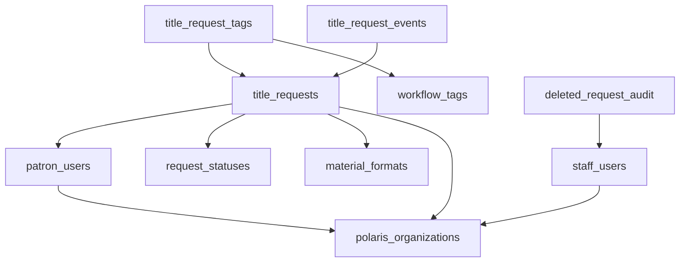

<!-- generated-by: gsd-doc-writer -->
# Schema Map

This document outlines the database schema for the Suggest-a-Purchase application, including collections, fields, and relationships. The system is built on PocketBase.

## Core Entities

### title_requests
The central collection for all material suggestions.

| Field | Type | Description |
|-------|------|-------------|
| `patron` | Relation (patron_users) | The patron who submitted the suggestion. |
| `barcode` | Text | Patron's library card barcode (denormalized). |
| `status` | Text | Status code (suggestion, pending_hold, hold_placed, outstanding_purchase, closed). |
| `statusRef` | Relation (request_statuses) | Reference to the status lookup. |
| `title` | Text | Title of the material. |
| `author` | Text | Author, artist, or director. |
| `identifier` | Text | ISBN, ISSN, or UPC. |
| `format` | Text | Material format code (book, dvd, etc.). |
| `formatRef` | Relation (material_formats) | Reference to the format lookup. |
| `agegroup` | Text | Audience group code (adult, teen, children). |
| `audienceGroup` | Relation (audience_groups) | Reference to the audience group lookup. |
| `libraryOrgId` | Text | Polaris Organization ID for the library. |
| `libraryOrganization` | Relation (polaris_organizations) | Reference to the library organization. |
| `closeReason` | Text | Code for why a request was closed. |
| `closeReasonRef` | Relation (request_close_reasons) | Reference to the close reason lookup. |
| `bibid` | Text | Polaris Bibliographic Record ID (if matched/created). |
| `notes` | Editor | Staff notes and system-generated activity log. |
| `created` | Date | Submission timestamp. |
| `updated` | Date | Last modification timestamp. |

## User Management

### staff_users
Auth collection for library staff.

| Field | Type | Description |
|-------|------|-------------|
| `role` | Select | staff, admin, super_admin. |
| `libraryOrgId` | Text | The library organization this staff member belongs to. |
| `libraryOrganization` | Relation (polaris_organizations) | Reference to the library. |
| `branchOrganization` | Relation (polaris_organizations) | Reference to the specific branch. |
| `scope` | Select | system, library (controls administrative reach). |
| `active` | Bool | Whether the account is enabled. |

### patron_users
Auth collection for library patrons, automatically synced from Polaris.

| Field | Type | Description |
|-------|------|-------------|
| `barcode` | Text | Unique identifier (Library Card). |
| `libraryOrgId` | Text | The patron's home library ID. |
| `libraryOrganization` | Relation (polaris_organizations) | Reference to the home library. |
| `preferredPickupBranchId` | Text | Default pickup location ID. |

## Lookups & Scoped Data

### polaris_organizations
Cached hierarchy of organizations from Polaris.

| Field | Type | Description |
|-------|------|-------------|
| `organizationId` | Text | The Polaris integer ID. |
| `parentOrganization` | Relation (self) | Link to the parent (e.g., Branch -> Library). |
| `enabledForPatrons` | Bool | Whether patrons of this org can use the system. |

### Scoped Lookups
The following collections support both "system" defaults and "library" specific overrides:
- **material_formats**: Definitions of available formats (Book, DVD, etc.).
- **audience_groups**: Age group categories.
- **email_templates**: Templates for automated notifications.
- **rejection_templates**: Selectable responses for declining a suggestion.

## Configuration & Settings

### Settings Hierarchy
Settings follow a "System -> Library" inheritance pattern. If a library-specific record does not exist, the system default is used.

- **workflow_settings**: Enforces weekly limits, timeouts, and common author logic.
- **ui_settings**: Customizes logos, labels, and instructional text.
- **patron_library_settings**: Scoped labels for how statuses appear to patrons.
- **system_settings**: Global application state (Super Admin only).
- **polaris_settings**: Credentials and host for Polaris API.
- **smtp_settings**: Email server configuration.

## Audit & Logging

### title_request_events
Detailed audit trail of all actions taken on a suggestion.
- **Relationships**: Linked to `title_requests`.
- **Fields**: `eventType`, `fromStatus`, `toStatus`, `actorName`, `message`.

### deleted_request_audit
Permanent record of requests that have been deleted from the active system.
- **Fields**: Contains a full `snapshot` (JSON) of the record before deletion.

### Email & Job Logs
- **email_delivery_events**: Logs of every email attempt for a specific request.
- **job_runs**: Status of system background tasks.
- **scheduled_email_runs / deliveries**: Tracking for recurring jobs like the Weekly Staff Summary.

## Relationships Diagram (Conceptual)

## Business Logic Constraints

1. **Multi-Tenancy**: Scoping via `libraryOrgId` ensures staff only see requests for their own organization unless they have `super_admin` or `system` scope.
2. **Weekly Limits**: Patrons are limited by a configurable number of suggestions per 7-day rolling window (enforced in `pb_hooks/lib/records.js`).
3. **Duplicate Prevention**: The system checks for existing requests by the same patron with matching identifiers (ISBN) or Title/Format combinations.
4. **Data Normalization**: `title_requests` uses both flat text codes (for performance/simplicity) and Relation fields (for referential integrity) for Status, Format, and Audience.
